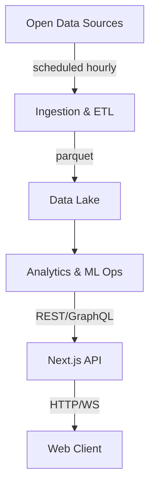

# Seantral Platform

High-resolution, near-real-time information on coastal and open-water conditions by aggregating open-data sources and proprietary beacon telemetry.

## Vision

Seantral delivers high‑resolution, near‑real‑time information on coastal and open‑water conditions by aggregating open‑data sources and, in future, proprietary beacon telemetry.

## Architecture



## Repository Structure

```
/ (root)
├─ apps/
│   ├─ web/                 # Next.js 15 frontend
│   └─ api/                 # FastAPI or Next API handlers
├─ packages/
│   ├─ ui/                  # Shared React components
│   ├─ data-pipeline/       # Python ingestion & ETL libs
│   └─ models/              # ML model code & notebooks
├─ infra/                   # IaC (Pulumi/Terraform)
└─ docs/                    # Documentation
```

## Quick Start

### Prerequisites

- Node.js (v18+)
- Python 3.12+
- npm or pnpm

### API Setup

```bash
# Navigate to API directory
cd apps/api

# Create and activate Python virtual environment
python -m venv venv
# On Windows:
.\venv\Scripts\activate
# On Unix/macOS:
source venv/bin/activate

# Install dependencies
pip install -r requirements.txt

# Start the API server
uvicorn main:app --reload
```

### Web App Setup

```bash
# In a separate terminal, from the root directory:
cd apps/web

# Install dependencies (if using npm)
npm install

# Start the development server
npm run dev
```

## Technology Stack

- **Frontend**: Next.js 15, React 19, Tailwind CSS 4
- **Mapping**: MapLibre GL JS
- **Charts**: react-plotly.js
- **Auth & Storage**: Supabase
- **Data Lake**: S3 / DuckDB
- **Pipelines**: AWS Lambda + Step Functions
- **CI/CD**: GitHub Actions
- **Monorepo**: pnpm + Turborepo

## License

MIT

## Attribution

Generated using EU Copernicus Marine Service information; NOAA NDBC data public domain. 