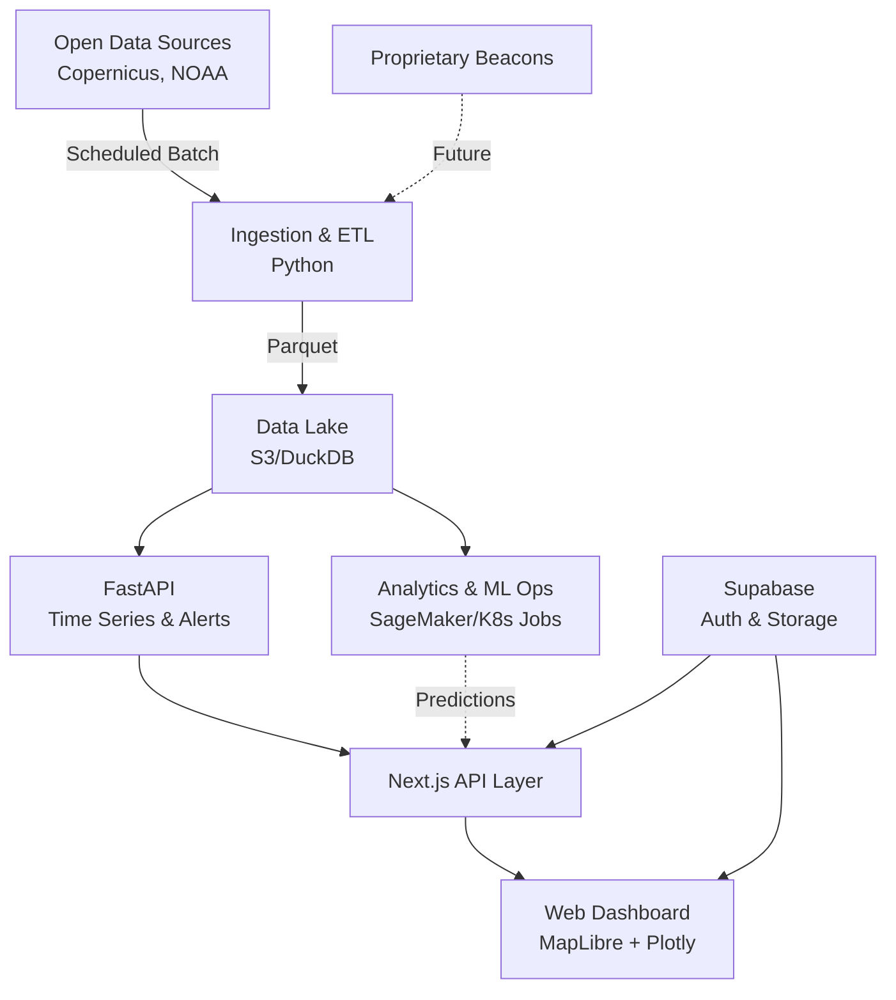
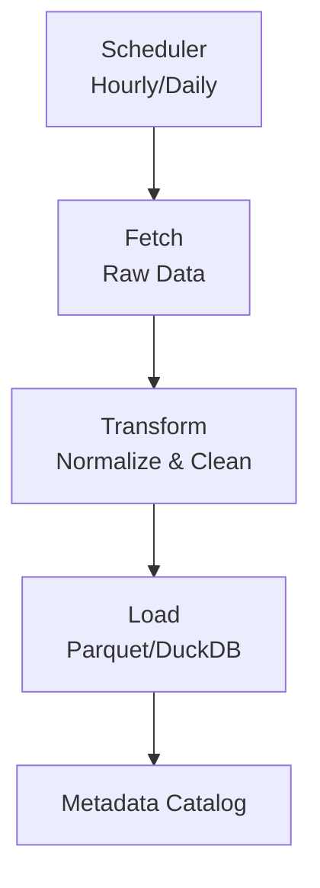
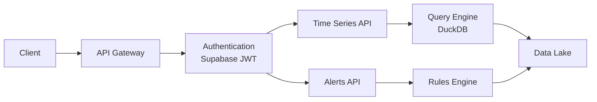
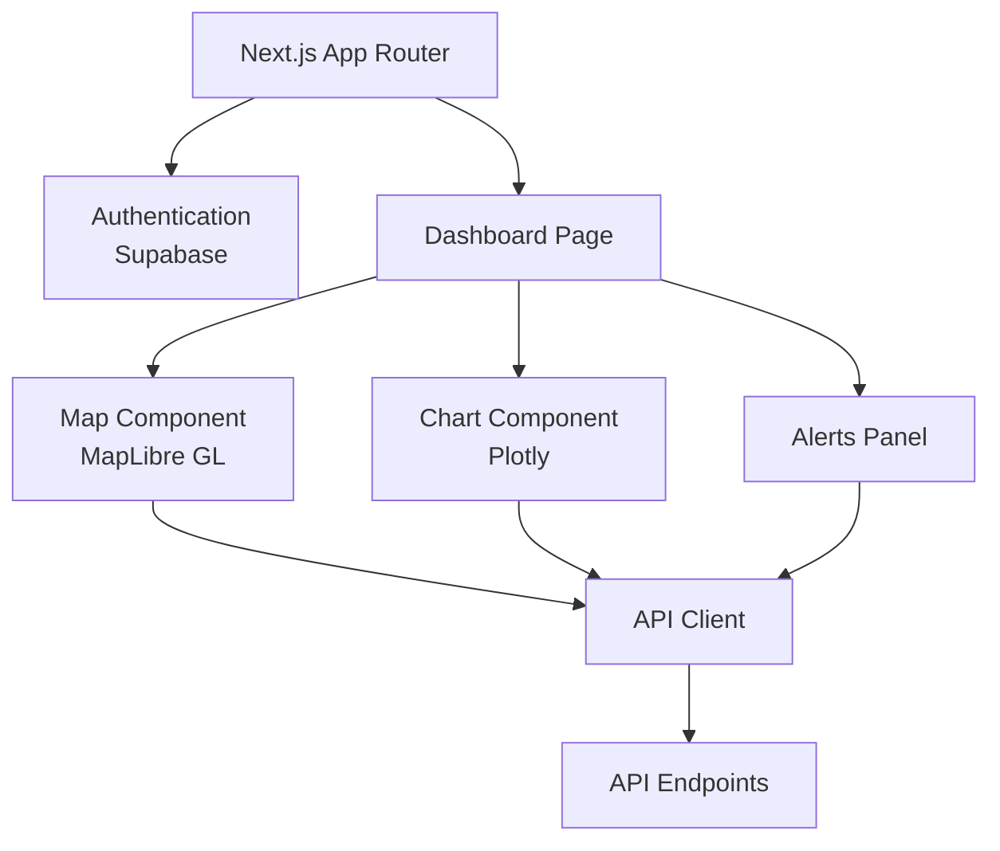
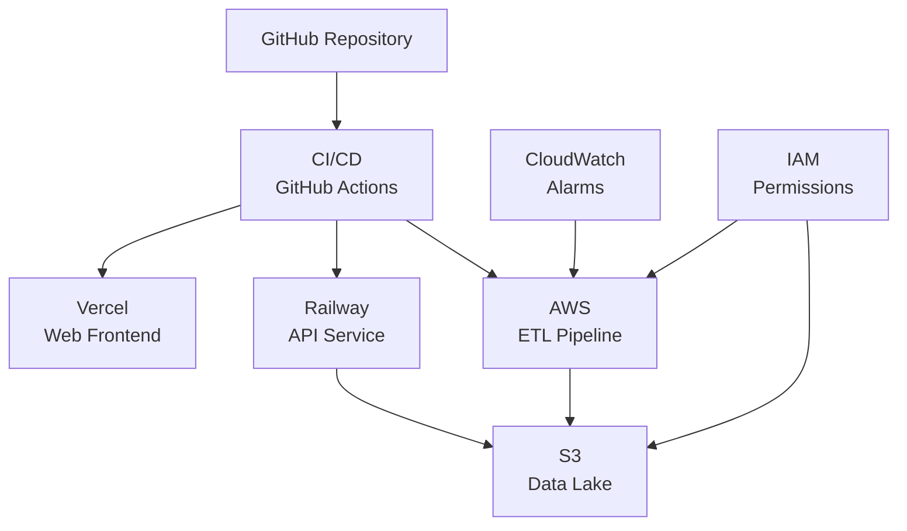

# Seantral Platform Architecture

This document outlines the architecture of the Seantral Platform, a system for high-resolution, near-real-time information on coastal and open-water conditions.

## System Overview

Seantral is a full-stack application with a modular, microservices-based architecture. It consists of:

1. **Data Ingestion & ETL Pipelines**: Python-based services that fetch and process data from various sources.
2. **Data Lake**: Storage for processed data in parquet format.
3. **API Layer**: FastAPI service providing RESTful endpoints for data access.
4. **Web Dashboard**: Next.js application with interactive visualizations.
5. **Authentication & User Management**: Managed by Supabase.

## Architecture Diagram

## Component Details

### Data Ingestion & ETL (Python)

- **Copernicus Marine (CMEMS)** - Surface temperature, salinity, currents
- **NOAA NDBC** - Buoy data including wave height, wind, air/water temp
- **Future: Proprietary Beacons** - Telemetry from custom hardware

Data is normalized to a standard format with ISO-19115 metadata and stored as columnar parquet files.

### API Layer (FastAPI)

The API provides standardized access to the data lake with endpoints for:

- `/v1/timeseries` - Time series data for a location
- `/v1/alerts` - Alert rules and triggered alerts

### Web Application (Next.js 15)

The web application provides an interactive dashboard with:

- MapLibre GL for spatial visualization
- Plotly for time series charts
- Real-time alerts and notifications

## Deployment Architecture

The system is deployed using a serverless approach:

- **Web**: Vercel (edge-optimized)
- **API**: Railway or AWS Fargate
- **Data Lake**: S3 Standard-IA with versioning
- **ETL Jobs**: AWS Lambda / Step Functions

## Authentication & Authorization

Authentication is handled by Supabase, which provides:

- JWT-based authentication
- Row-level security for data access
- OAuth integrations

## Data Flow

1. **Ingestion**: Raw data is fetched from sources on scheduled intervals
2. **Processing**: Data is normalized, cleaned, and enriched
3. **Storage**: Processed data is stored in the data lake
4. **Access**: API endpoints provide access to the data
5. **Visualization**: Web dashboard displays the data with interactive visualizations

## Scalability & Performance

- Edge API caching for high-traffic endpoints
- Columnar storage for efficient time series queries
- Serverless functions that auto-scale based on load
- Incremental builds via Turborepo for fast CI/CD

## Security Considerations

- All secrets stored in environment variables
- HTTPS/TLS for all communication
- JWT tokens for authentication
- Row-level security for data access
- Regular security scans via CodeQL

## Future Expansion

- LLM assistant for natural language queries
- Proprietary beacon integration
- Advanced analytics and forecasting
- Mobile application

## Technology Stack Summary

| Component | Technology | Rationale |
|-----------|------------|-----------|
| Web Frontend | Next.js 15 / React 19 | Modern React with SSR/ISR capabilities |
| UI Components | Tailwind CSS 4 | Utility-first CSS for rapid development |
| Maps | MapLibre GL JS | Open-source maps without vendor lock-in |
| Charts | Plotly.js | Scientific-grade visualization |
| API | FastAPI | High-performance, type-safe API framework |
| Data Lake | S3 + DuckDB | Serverless, columnar storage for analytics |
| Authentication | Supabase | Batteries-included auth with PostgreSQL |
| CI/CD | GitHub Actions | Integrated with repository |
| Monorepo | pnpm + Turborepo | Efficient build caching and workspace management | 